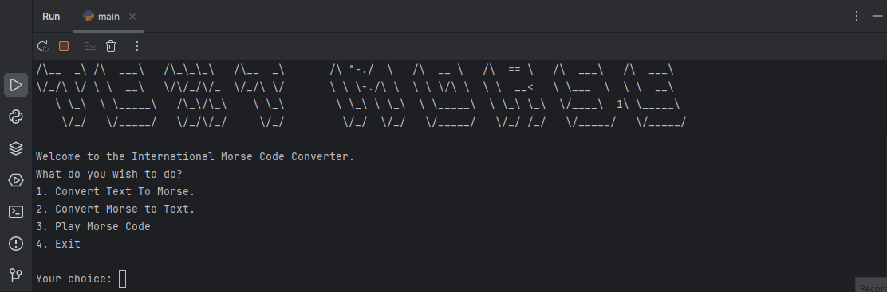

# Text to Morse Code Converter

**Morse code** is a method used in telecommunication to encode text character as standardized sequences of two different signal durations, called _dots and dashes_

Text Input restrictions:
1. **Letters**: 26 basic Latin letter A to Z.
2. **Numbers**: 0 to 9.
3. **Punctuation Marks**: . , ? \' ! / ( ) & : ; = + - _ " $ @

Morse Code Input restrictions:
1. **Character Set**: Only dots(.) and dashes(-).
2. **Spacing**: Separate characters by a space and words by three spaces.

Features included:
1. Convert text to morse code.
2. Convert morse code to text.
3. Play morse code.
4. Save morse code in clipboard.



## Getting Started

### Prerequisites

<b>For Windows:</b>
<br/> 

Download and Install the latest version of [Python](https://www.python.org/downloads/).<br/><br/>
Download and Install the latest version of [PyCharm Community Edition](https://www.jetbrains.com/pycharm/download/?section=windows).<br/>


<b>For Linux:</b>
<br/> 

<b>Linux</b> comes preinstalled with Python.<br/><br/>
To install the latest version of PyCharm Community Edition, run the following command:
```
sudo snap install pycharm-community --classic
```

### Installing

You can install all the required packages listed in the requirements.txt file for the project at the same time: 


<b>On Windows type:</b>
<br/> 
```
python -m pip install -r requirements.txt
```

<b>On MacOS type:</b>
<br/> 
```
pip3 install -r requirements.txt
```

## Built Using
<p>
  
  
  
  
  
</p>

## Authors

*Initial work* - [grandeurkoe](https://github.com/grandeurkoe)
